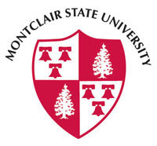

Montclaire University. What can I say? It was fun! It was our very first S.T.E.M. trip, so we were pleased. We got to see some really cool and fun stuff. 

We started off with a tour of the actual place. It was a lot of people's first time in a campus so we were in awe of the small civilazation that was Montclaire University. We got to go into a bunch of buildings and rooms in those buildings each with a different purpouse. We also saw a lot of students(many stressed and sleep deprived) which scared me personally for what was to come.

They also had some really cool and interesting technollogy. They had really advanced microscopes that I can only dream of using and new equipment in most rooms. They had machines whose functions confused me and some that I found really cool. They had rooms and rooms FILLED with televisions and computers which seemed crazy to me.

All in all, we were all glad to go on a field trip and I believe I' m speaking for all of us when i say that it was a super fun and unieque experience.

