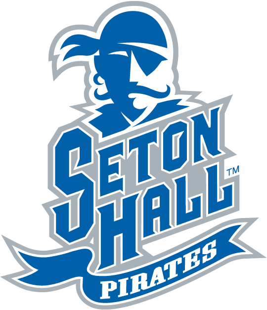

#There was a meeting being held in the gruidance for all STEM students and top class seniors. I was so happy to get an opportunity to be in the meeting. There was a really nice woman who explained all the beniefts of studying at Seton Hall. She answered any questions that we had. Joining the STEM program was such a great idea! If I hadn't join I would had never knew all the course that Seton Hall University as to offer.

